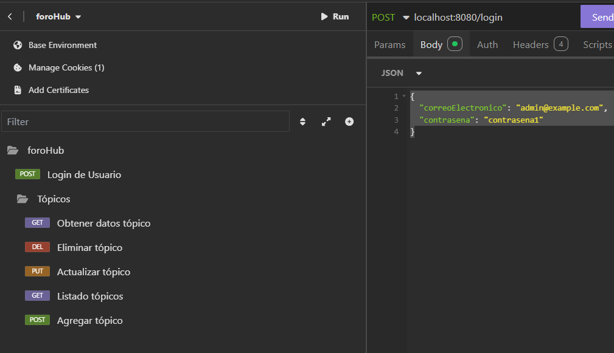

# API de Tópicos - Foro

Esta API permite gestionar los tópicos de un foro. Los usuarios pueden crear, listar, modificar, buscar y eliminar tópicos.

La autenticación está basada en **JWT** (JSON Web Token). Los usuarios deben autenticarse para acceder a los endpoints protegidos, y los tokens tienen una expiración de 2 horas.

## Endpoints

### 1. **Listar todos los tópicos**
- **Método**: `GET`
- **Ruta**: `/topicos`
- **Descripción**: Obtiene todos los tópicos registrados en el foro.
- **Respuesta**: Lista de tópicos.

### 2. **Crear un nuevo tópico**
- **Método**: `POST`
- **Ruta**: `/topicos`
- **Descripción**: Crea un nuevo tópico.
- **Cuerpo**:
  ```json
  {
    "titulo": "Curso de Java",
    "mensaje": "Contenido del curso de Java.",
    "status": "Activo",
    "autor": "Juan Pérez",
    "curso": "Java 101"
  }
- **Respuesta**: Detalles del tópico creado.

### 3. **Buscar un tópico por ID**
- **Método**: `GET`
- **Ruta**: `/topicos/{id}`
- **Descripción**: Obtiene los detalles de un tópico específico por su ID.
- **Respuesta**: Detalles del tópico.

### 4. **Modificar un tópico**
- **Método**: `PUT`
- **Ruta**: `/topicos/{id}`
- **Descripción**:  Modifica el estado `(status)` o el curso asociado a un tópico.
- **Cuerpo**:
  ```json
  {
    "status": "Inactivo",
    "idCurso": "1"
  }
- **Respuesta**: Detalles del tópico actualizado.

### 5. **Eliminar un tópico**
- **Método**: `DELETE`
- **Ruta**: `/topicos/{id}`
- **Descripción**: Elimina un tópico por su ID.
- **Respuesta**: Confirmación de eliminación.

## Autenticación
La API utiliza JWT para la autenticación de usuarios.

### 1. **Obtener el Token**
Para acceder a los endpoints protegidos, primero debes autenticarte utilizando el endpoint de login. Debes enviar un POST con las credenciales (correo electrónico y contraseña) al siguiente endpoint:
- **Método**: `POST`
- **Ruta**: `/login`
- **Cuerpo**:
  ```json
  {
    "correoElectronico": "admin@example.com",
    "contrasena": "contrasena1"
  }
Si las credenciales son correctas, recibirás un token JWT que puedes usar para autenticar las solicitudes posteriores.

### 2. **Usar el Token**
Cuando recibas el token JWT, debes incluirlo en el encabezado Authorization de las siguientes solicitudes para acceder a los endpoints protegidos:
- **Encabezado**:
`Authorization: Bearer {token}`

### **Expiración del Token**
El token tiene una expiración de 2 horas. Después de este tiempo, necesitarás autenticarte nuevamente para obtener un nuevo token.

